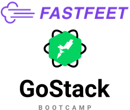

<h1 align="center">
  
</h1>

Este codigo representa a minha solução do desafio do Bootcamp GoStack 10.0

 <a href="#rocket-tecnologias">Tecnologias</a>&nbsp;&nbsp;&nbsp;|&nbsp;&nbsp;&nbsp;
 <a href="#computer-instalação-execução-e-desenvolvimento">Instalação, execução e desenvolvimento</a>&nbsp;&nbsp;&nbsp;|&nbsp;&nbsp;&nbsp;
 <a href="#-como-contribuir">Como contribuir</a>

<strong>Links dos desafios:</strong>
- [Desafio 1](https://github.com/rocketseat/bootcamp-gostack-desafio-02)
- [Desafio 2](https://github.com/rocketseat/bootcamp-gostack-desafio-03)
- [Desafio 3](https://github.com/rocketseat/bootcamp-gostack-desafio-09)
- [Desafio 4](https://github.com/rocketseat/bootcamp-gostack-desafio-10)

## :rocket: Tecnologias

Esse projeto foi desenvolvido com as seguintes tecnologias:

- [Node.js](https://nodejs.org/en/)
- [React](https://reactjs.org/)
- [Docker](https://www.docker.com/)
- [Docker Compose](https://docs.docker.com/compose/)
- [PostgreSQL](https://www.postgresql.org/)
- [MongoDB](https://www.mongodb.com/)
- [Express](https://github.com/expressjs/express)
- [Redis](https://redis.io/)
- [Bee-Queue](https://github.com/bee-queue/bee-queue)

## :computer: Instalação, execução e desenvolvimento

Faça um clone desse repositório.

### Pré-requisitos
- [Docker](https://www.docker.com/)
- [Docker Compose](https://docs.docker.com/compose/)

### Backend
- A partir da raiz do projeto, entre na pasta rodando `cd server`;
- Rode `yarn` para instalar sua dependências;
- Rode `cp .env.example .env` e preencha o arquivo `.env` com SUAS variáveis ambiente;
- Rode `docker-compose up -d` para montar o ambiente;
- Rode `yarn sequelize db:migrate` para executar as migrations;
- Para executar somente a migration de `admin-user` rode o comando `yarn sequelize db:seed --seed 20200212180839-admin-user.js`
- Importe o arquivo `Insomnia.json` desse repositório no Insomnia;

[Rotas do backend](https://github.com/EliasGcf/fastfeet/blob/master/server/README.md)

## 🤔 Como contribuir

- Faça um fork desse repositório;
- Cria uma branch com a sua feature: `git checkout -b minha-feature`;
- Faça commit das suas alterações: `git commit -m 'feat: Minha nova feature'`;
- Faça push para a sua branch: `git push origin minha-feature`;

---

Feito com ♥ by [EliasGcf](https://www.linkedin.com/in/eliasgcf/)
