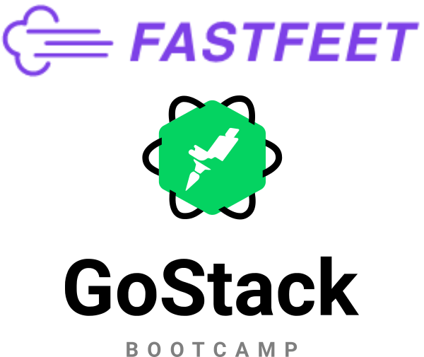

<h1 align="center">
	
</h1>

<h3 align="center">
  FastFeet, o início
</h3>

Confira em <a href="https://github.com/EliasGcf/fastfeet/blob/master/server/ETAPA_2.md">ETAPA 2</a> as instruções para os próximos passos

<h3 align="center">
  :warning: Etapa 1/4 do Desafio Final :warning:
</h3>

Esse desafio faz parte do Desafio Final, que é uma aplicação completa (Back-end, Front-end e Mobile) que é avaliada para emissão do Certificado do Bootcamp GoStack, por isso é fundamental que ele seja feito com muito empenho!

<blockquote align="center">“Não espere para plantar, apenas tenha paciência para colher”!</blockquote>

  <a href="#rocket-sobre-o-desafio">Sobre o desafio</a>

## :rocket: Sobre o desafio

A aplicação que iremos dar início ao desenvolvimento a partir de agora é um app para uma transportadora fictícia, o FastFeet.

Nesse primeiro desafio vamos criar algumas funcionalidades básicas que aprendemos ao longo das aulas até aqui. Esse projeto será desenvolvido aos poucos até o fim da sua jornada onde você terá uma aplicação completa envolvendo back-end, front-end e mobile, que será utilizada para a **certificação do bootcamp**, então, bora pro código!

### **Um pouco sobre as ferramentas**

Você deverá criar a aplicação do zero utilizando o [Express](https://expressjs.com/), além de precisar configurar as seguintes ferramentas:

- Sucrase + Nodemon;
- ESLint + Prettier + EditorConfig;
- Sequelize (Utilize PostgreSQL ou MySQL);

### **Funcionalidades**

Abaixo estão descritas as funcionalidades que você deve adicionar em sua aplicação.

### **1. Autenticação**

Permita que um usuário se autentique em sua aplicação utilizando e-mail e uma senha.

Crie um usuário administrador utilizando a funcionalidade de [seeds do sequelize](https://sequelize.org/master/manual/migrations.html#creating-first-seed), essa funcionalidade serve para criarmos registros na base de dados de forma automatizada.

Para criar um seed utilize o comando:

    yarn sequelize seed:generate --name admin-user

No arquivo gerado na pasta `src/database/seeds` adicione o código referente à criação de um usuário administrador:

    const bcrypt = require("bcryptjs");

    module.exports = {
      up: QueryInterface => {
        return QueryInterface.bulkInsert(
          "users",
          [
            {
              name: "Distribuidora FastFeet",
              email: "admin@fastfeet.com",
              password_hash: bcrypt.hashSync("123456", 8),
              created_at: new Date(),
              updated_at: new Date()
            }
          ],
          {}
        );
      },

      down: () => {}
    };

Agora execute:

    yarn sequelize db:seed:all

Agora você tem um usuário na sua base de dados, utilize esse usuário para todos os logins que você fizer.

- A autenticação deve ser feita utilizando JWT.
- Realize a validação dos dados de entrada;

### 2. Gestão de destinatários

Você agora precisa permitir que destinatários sejam mantidos (cadastrados/atualizados) na aplicação, e esses devem ter o **nome** do destinatário e campos de endereço: **rua**, **número**, **complemento**, **estado**, **cidade** e **CEP**.

Utilize uma nova tabela no banco de dados chamada `recipients` para guardar informações do destinatário.

O cadastro de destinatários só pode ser feito por administradores autenticados na aplicação.

O destinatário não pode se autenticar no sistema, ou seja, não possui senha.

---

Feito com ♥ by Rocketseat :wave: [Entre na nossa comunidade!](https://discordapp.com/invite/gCRAFhc)
